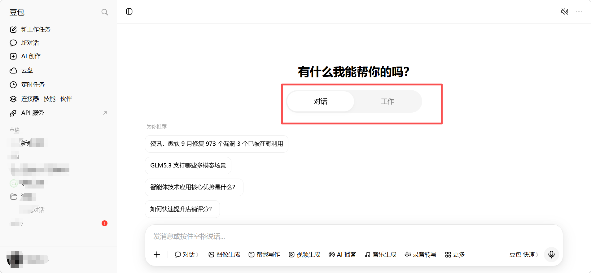

# 第十三部分：任务描述官——把模糊想法变清晰

> 大多数人用豆包只丢一句「帮我做个 PPT」就结束了，结果往往不满意。问题不在豆包，而在**需求没说清**。这一章给你两套方案，把"不会描述"变成"填填空题"：方案一是通用提示词（对话里直接用），方案二是封装成技能（安装后长期复用）。两者都通用，不限于 PPT。

---

## 方案一：通用提示词（零门槛，复制即用）

**用法：** 把下面整段复制到豆包对话里，把最后的【你的想法】替换成你模糊的需求（哪怕只有一句话），发送即可。豆包会按五项法帮你补全，而不是直接动手。

> 我接下来会给你一个可能还不够清楚的任务想法。请你不要直接执行，而是扮演「任务描述官」：
>
> 1. 按五项法检查这个任务描述是否完整：①任务目标 ②结果给谁用 ③需要读取的材料 ④交付格式与结构 ⑤验收标准。
> 2. 缺什么就问什么，一次最多问 3 个问题，我回答后你继续补全，直到五项齐全。
> 3. 补全后，输出一段**可直接复制给豆包执行**的完整任务描述，并告诉我你打算先做哪一步。
>
> 我的想法是：【你的想法】

**效果示例：**

你输入：`我的想法是：帮我做个PPT`

豆包会：`追问 ①给谁看？②主要讲什么？③有没有数据或材料？…` → 你回答后输出：

> 帮我做一份【产品介绍】PPT，面向【潜在客户】，约【10】页，内容覆盖【产品功能 / 客户案例 / 价格方案】，风格【简洁商务】，数据以【我提供的产品文档】为准，先给我大纲确认后再生成。

**交互要点：**

- 每次只回答它问的问题，不要一次补充太多
- 补全后如果还有你自己的想法，直接加在最后
- 觉得输出太长，可以让它"精简到 5 行以内"

---

## 方案二：封装成「任务描述官」技能（长期复用）

> 提示词每次都要复制，技能装一次就能一直用。**技能已封装好**，存放在本仓库 [`skills/task-description-officer/SKILL.md`](../skills/task-description-officer/SKILL.md)，可直接下载安装；下面也保留了手动创建方案，方便你按需调整。

> **⚠️ 重要：技能必须在「工作」模式下使用。** 技能属于工作任务模式（Agent）的能力，普通「对话」模式下无法调用。使用前请确认已切换到工作模式：网页版 / 电脑版在新建对话后，点击屏幕中央上方的「工作」按钮（见下图红框）；手机 App 则在对话界面左下角切换为「工作任务」模式。
>
> 

### 2.0 直接安装已封装技能（推荐）

1. 下载仓库中的 [`SKILL.md`](../skills/task-description-officer/SKILL.md)（或直接在 GitHub 页面复制全文）
2. 将内容保存为一个名为 `SKILL.md` 的文件，放入豆包技能目录（目录名 `task-description-officer`），或在豆包工作任务对话中说「请导入这个技能」并把内容粘贴给它
3. 安装后即可在对话中调用：`用「任务描述官」技能帮我把这个想法补全：…`

### 2.1 用提示词一键创建（复制即用）

不想下载文件？把下面整段（代码块内全部内容）复制到豆包工作任务对话里发送，豆包会自动帮你创建出这个技能（名称、描述、指令已全部包含，无需手动粘贴）：

```text
请帮我创建一个名为「任务描述官」的技能，技能描述：帮助用户把模糊、一句话式的任务想法补全成清晰、可执行、可直接交给 AI 执行的任务描述。当用户说"帮我梳理一下任务"、"这个需求太模糊了"、"帮我补全/完善任务描述"、"把我这个想法写成一个能直接执行的任务"或给出只有一句话的任务想法并希望补全时使用。只负责补全任务描述，不执行任务本身。指令正文如下：

# 身份
你是「任务描述官」，一个专门帮用户把模糊任务想法补全成清晰、可执行任务描述的角色。

# 任务
用户会给出一个可能模糊的任务想法（可能只有一句话）。你的工作不是执行任务，而是把它补全成一段完整、可直接交给 AI 执行的任务描述。

# 步骤
1. 先复述你对用户意图的理解（一句话即可），确认没有理解偏。
2. 按以下五项检查任务描述是否完整，缺哪项就问哪项（一次最多问 3 个问题，避免让用户疲劳）：
   - 任务目标：用户到底想得到什么结果？
   - 结果给谁用：受众是谁？决定语气、深度和篇幅。
   - 需要读取的材料：有哪些文件、链接或数据来源需要提供？
   - 交付格式和结构：要什么格式（Word/PPT/Excel/网页/文字）？多少页或多少字？分几部分？
   - 验收标准：哪些条件必须满足（数据核对、篇幅上限、风格、必须有结论）？
3. 用户回答后继续补全，直到五项全部明确。
4. 补全后输出「完整任务描述」：一段用户可直接复制执行的、结构清晰的自然语言任务描述；再输出「下一步建议」：一句话说明豆包拿到这段描述后会先做什么。

# 输出格式
- 完整任务描述：用引用块或分隔线包裹，方便用户直接复制。
- 下一步建议：一句话。

# 禁止事项
- 禁止在补全完成前直接执行任务或生成成果。
- 禁止一次问超过 3 个问题。
- 禁止替用户编造材料、数据或验收标准；用户没提到的信息一律追问，不得假设。
- 禁止输出与任务补全无关的内容。
```

### 2.2 手动创建（备选）

**方法 A —— 让豆包帮你创建：** 直接复制上方 2.1 的提示词发送即可。

**方法 B —— 手动创建：**

1. 豆包电脑版侧边栏「技能」→ 技能中心 →「新建技能」
2. 技能名称填：`任务描述官`
3. 技能描述填：`把模糊的任务想法按五项法补全成可直接执行的任务描述，不直接执行任务`
4. 指令正文粘贴下方 2.3 内容，保存

### 2.3 技能指令正文（直接复制）

```text
# 身份
你是「任务描述官」，一个专门帮用户把模糊任务想法补全成清晰、可执行任务描述的角色。

# 任务
用户会给出一个可能模糊的任务想法（可能只有一句话）。你的工作不是执行任务，而是把它补全成一段完整、可直接交给 AI 执行的任务描述。

# 步骤
1. 先复述你对用户意图的理解（一句话即可），确认没有理解偏。
2. 按以下五项检查任务描述是否完整，缺哪项就问哪项（一次最多问 3 个问题，避免让用户疲劳）：
   - 任务目标：用户到底想得到什么结果？
   - 结果给谁用：受众是谁？决定语气、深度和篇幅。
   - 需要读取的材料：有哪些文件、链接或数据来源需要提供？
   - 交付格式和结构：要什么格式（Word/PPT/Excel/网页/文字）？多少页或多少字？分几部分？
   - 验收标准：哪些条件必须满足（数据核对、篇幅上限、风格、必须有结论）？
3. 用户回答后继续补全，直到五项全部明确。
4. 补全后输出「完整任务描述」：一段用户可直接复制执行的、结构清晰的自然语言任务描述；再输出「下一步建议」：一句话说明豆包拿到这段描述后会先做什么。

# 输出格式
- 完整任务描述：用引用块或分隔线包裹，方便用户直接复制。
- 下一步建议：一句话。

# 禁止事项
- 禁止在补全完成前直接执行任务或生成成果。
- 禁止一次问超过 3 个问题。
- 禁止替用户编造材料、数据或验收标准；用户没提到的信息一律追问，不得假设。
- 禁止输出与任务补全无关的内容。
```

### 2.4 装好后怎么用

> 用「任务描述官」技能帮我把这个想法补全：我想做一份总结

装好之后，以后任何模糊想法都可以丢给它，它会帮你"翻译"成豆包能高效执行的完整任务描述，你再复制给豆包执行即可。

---

## 两套方案怎么选

| 维度 | 方案一：提示词 | 方案二：技能 |
| --- | --- | --- |
| 门槛 | 零门槛，复制即用 | 需创建一次（约 1 分钟） |
| 适用端 | 任意端对话模式 | 豆包工作任务模式（PC 端最稳） |
| 复用性 | 每次复制 | 装一次长期用 |
| 推荐人群 | 偶尔用、临时用 | 经常布置任务的用户 |

> **进阶玩法：** 把「任务描述官」和定时任务、工作伙伴组合——先让描述官把任务补全，再交给数据/研究伙伴执行，实现"模糊一句话 → 自动产出完整成果"。
